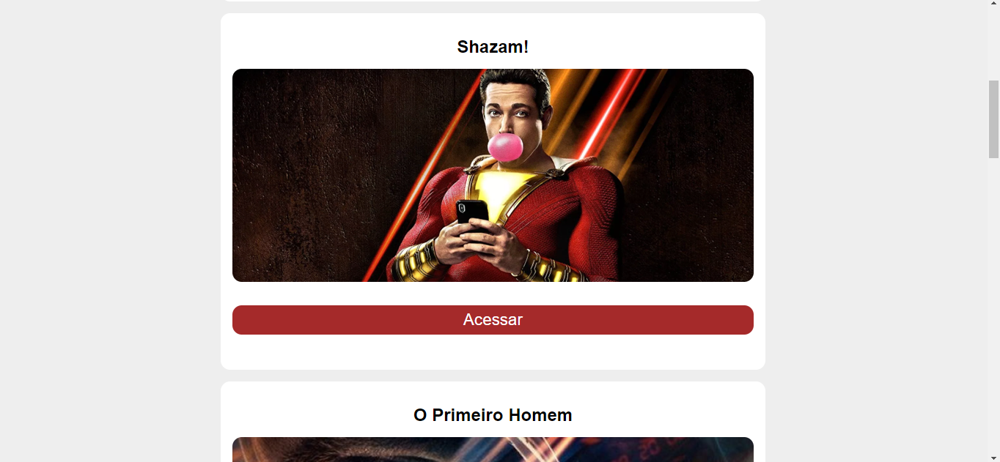

# Filmaria

Projeto de um site que possui informações de alguns filmes.

## Minha aplicação:

## Tecnologias utilizadas:

<ul>
  <li>HTML5</li>
  <li>CSS3</li>
  <li>JavaScript</li>
  <li>React.js</li>
   <li>Axios</li>
</ul>

## Sobre a aplicação:

Esse sistema consome dados de uma API usando axios e usa o React.js para modelar e mostrar os dados na tela. Toda a parte de rota foi feita usando recursos do
framework. Além de escolher um filme e acessar suas informações, o usuário pode pesquisar seu trailer e salvar em uma lista de favoritos.

## Por que esse sistema?

Esse sistema foi realizado por mim para desenvolvimento do portfólio pessoal, nele também consegui aplicar solidos conhecimentos que tenho no framework React.js
em uma aplicação real.

## Ficaria feliz com Feedbacks:

Email: raphaeldesousalm@gmail.com  
Linkdin: https://www.linkedin.com/in/raphaellima98/
